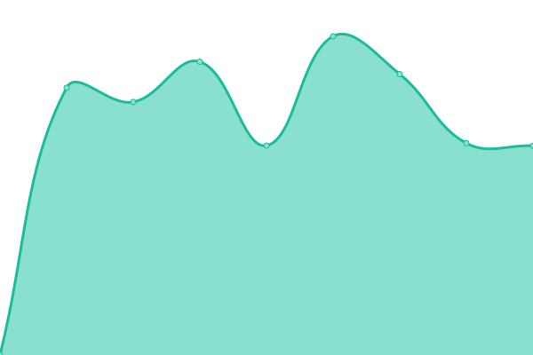
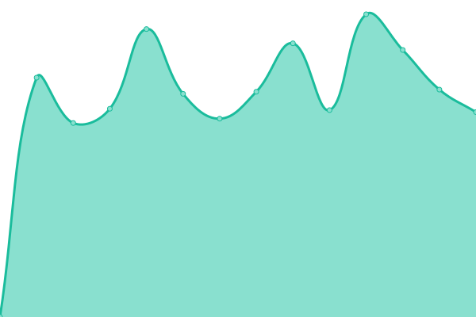
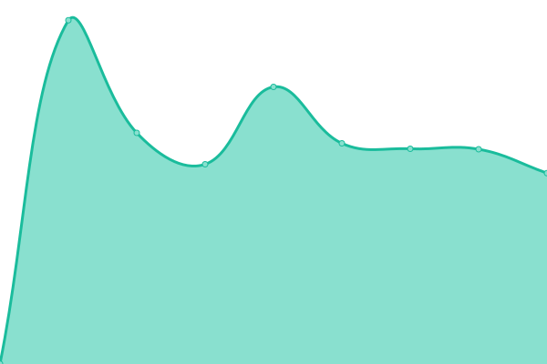

# [📈 Live Status](https://AutiCodes.github.io/uptime): <!--live status--> **🟩 All systems operational**

This repository contains the open-source uptime monitor and status page for [KelvinCodes](https://auticodes.nl), powered by [Upptime](https://github.com/upptime/upptime).

With [Upptime](https://upptime.js.org), you can get your own unlimited and free uptime monitor and status page, powered entirely by a GitHub repository. We use [Issues](https://github.com/AutiCodes/uptime/issues) as incident reports, [Actions](https://github.com/AutiCodes/uptime/actions) as uptime monitors, and [Pages](https://AutiCodes.github.io/uptime) for the status page.

<!--start: status pages-->
<!-- This summary is generated by Upptime (https://github.com/upptime/upptime) -->
<!-- Do not edit this manually, your changes will be overwritten -->
<!-- prettier-ignore -->
| URL | Status | History | Response Time | Uptime |
| --- | ------ | ------- | ------------- | ------ |
|  [AutiCodes.nl](https://auticodes.nl) | 🟩 Up | [auti-codes-nl.yml](https://github.com/AutiCodes/uptime/commits/HEAD/history/auti-codes-nl.yml) | 

 792ms
     
 | 

<a href="https://AutiCodes.github.io/uptime/history/auti-codes-nl">100.00%</a>
    

|  [AllDayTechAndGaming blog](https://alldaytechandgaming.nl) | 🟩 Up | [all-day-tech-and-gaming-blog.yml](https://github.com/AutiCodes/uptime/commits/HEAD/history/all-day-tech-and-gaming-blog.yml) | 

 1142ms
     
 | 

<a href="https://AutiCodes.github.io/uptime/history/all-day-tech-and-gaming-blog">100.00%</a>
    

|  [T.R.M.C Wordpress](https://trmc.nl) | 🟩 Up | [t-r-m-c-wordpress.yml](https://github.com/AutiCodes/uptime/commits/HEAD/history/t-r-m-c-wordpress.yml) | 

 1832ms
     
 | 

<a href="https://AutiCodes.github.io/uptime/history/t-r-m-c-wordpress">100.00%</a>
    

|  [T.R.M.C Club Manager](https://club.trmc.nl) | 🟩 Up | [t-r-m-c-club-manager.yml](https://github.com/AutiCodes/uptime/commits/HEAD/history/t-r-m-c-club-manager.yml) | 

 1111ms
     
 | 

<a href="https://AutiCodes.github.io/uptime/history/t-r-m-c-club-manager">100.00%</a>
    

|  [Domain Name Server](78.47.239.19) | 🟩 Up | [domain-name-server.yml](https://github.com/AutiCodes/uptime/commits/HEAD/history/domain-name-server.yml) | 

 96ms
     
 | 

<a href="https://AutiCodes.github.io/uptime/history/domain-name-server">100.00%</a>
    

|  [Email inbound](78.47.239.19) | 🟩 Up | [email-inbound.yml](https://github.com/AutiCodes/uptime/commits/HEAD/history/email-inbound.yml) | 

 96ms
     
 | 

<a href="https://AutiCodes.github.io/uptime/history/email-inbound">100.00%</a>
    

|  [Email outbound](78.47.239.19) | 🟩 Up | [email-outbound.yml](https://github.com/AutiCodes/uptime/commits/HEAD/history/email-outbound.yml) | 

 97ms
     
 | 

<a href="https://AutiCodes.github.io/uptime/history/email-outbound">100.00%</a>
    

<!--end: status pages-->

[**Visit our status website →**](https://AutiCodes.github.io/uptime)

## 📄 License

- Powered by: [Upptime](https://github.com/upptime/upptime)
- Code: [MIT](./LICENSE) © [Anand Chowdhary](https://anandchowdhary.com), supported by [Pabio](https://pabio.com)
- Data in the `./history` directory: [Open Database License](https://opendatacommons.org/licenses/odbl/1-0/)
